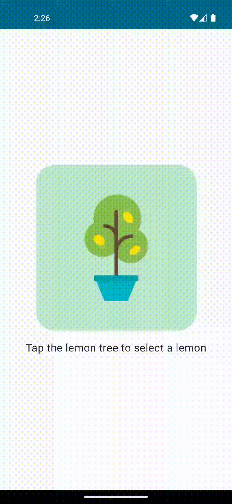

# Lemonade App

Simple and fun app to pass the time.

Project of the Base Android with Compose course, 
section Unit 2 Building App UI > Pathway 2 > 4 Practice: Click behavior
https://developer.android.com/codelabs/basic-android-kotlin-compose-button-click-practice-problem

